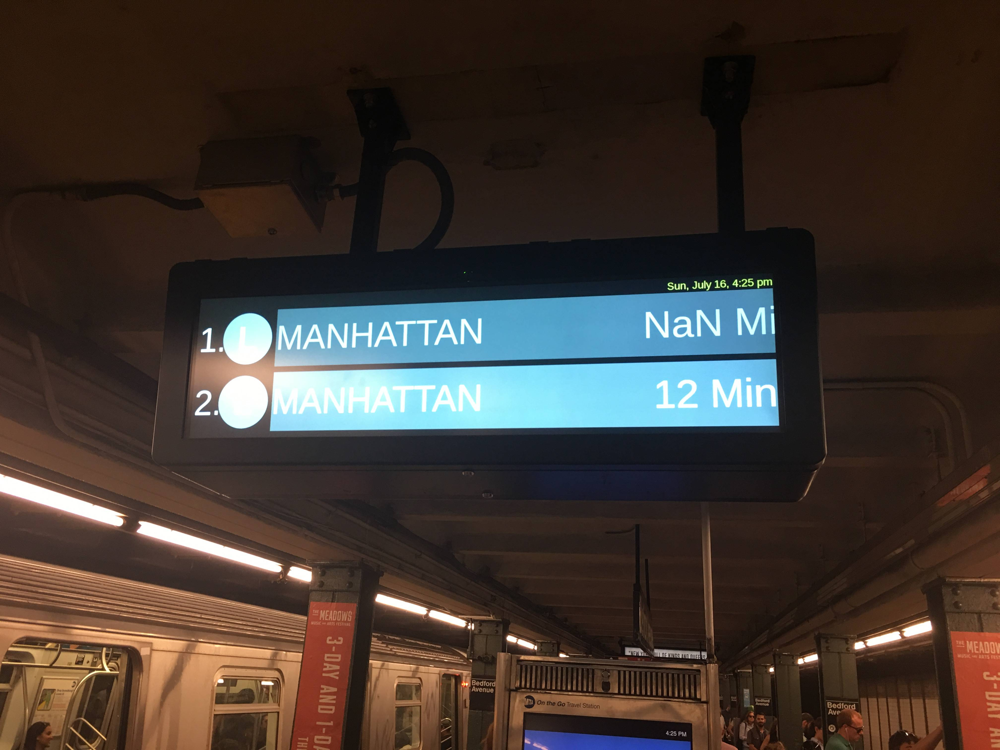

# Intro to JavaScript




## History of JS

  * Created by Brendan Eich in 1995
    - Technically called Mocha at the time then LiveScript (ewww)
    - Microsoft copied it and called theirs Jscript (less eww)
    - Named JavaScript as a means of using some of the popularity of Java
  * Stayed almost dormant for 10 years (1999 - 2009)
  * Popularity for the language grows from 2006
    * Google Maps - 2005*
    * AJAX
    * JQuery - 2006
    * Chrome V8 Engine Opensourced - 2008
    * NodeJs Ryan Dahl - 2009
    * Here come the transpilers and libraries

## DONT BREAK THE WEB!!!!

What is a transpiler, compiler and interpreter??

  Interesting JS libraries to note
  - Backbonejs
  - Underscore
  - Emberjs
  - Angularjs


### How to learn a new language

  **ALL** programming languages have three basic things

  - Syntax
  - Programmatic Thinking
  - Design Patterns


## Thinking about JS

* Review request Response cycle
  * Many times our response is a string of html
  * Now this string of HTML includes JavaScript code

* JavaScript's Domain
  * Scripting             (see: ECMAScript)
  * Document Object Model (later)
  * Browser Object Model  (later)

* Data Types
  * Constructors versus Literals

    ```js
    let someNum = new Number(1)
    let anotherNum = 1
    someNum === anotherNum // false
    ```
* Primitives
    * String
      * Single quotes
      `'I'm a string`
      * Double quotes
      `"I'm another string"`
      * Backticks   (see: string templates)
      `` `I'm a string with interpolation ${'Yay!'}` ``
    * Number: one numeral type
      * Negative `-1`
      * Exponent `-1e2`
      * Float `-1.1e2`
      * NaN `'hello' * 3`
      * parseInt / parseFloat

        ```js
        parseInt('123')             // 123
        parseInt('123.456')         // 123
        parseInt('one two three')   // NaN
        parseFloat('123')           // 123
        parseFloat('123.456')       // 123.456
        parseFloat('one two three') // NaN
        ```
    * Boolean
      * Falsy
        * false `Boolean(false)`
        * 0 `Boolean(0)`
        * '' (empty string) `Boolean('')`
        * null `Boolean(null)`
        * undefined `Boolean(undefined)`
        * NaN `Boolean(NaN)`
      * Truthy - everything else
    * Undefined
      * Variable that has been declared but not defined

      ```js
      let someVar
      console.log(someVar) // undefined
      ```
    * Null
      * An assignment value that represents nothing

      ```js
      let someVar = null
      console.log(someVar) // null
      ```
    * Symbol (later)
  * Non-primitives
    * Object `person = {name: 'Tim'}`
      * Accessing properties
        * `person.name`
        * `person["name"]`
      * Adding methods
        * `person.greet = function(name) { return `Hello, ${name}` }`
      * Value of `this`
        * `person.greet = function(name) { return `${this.name} greets ${name}`}`
    * Function
      * Function declaration / definition / statement

      ```js
      function doSomething() {}
      ```
      * Function expression (later)

      ```js
      let doSomething = function() {}
      let doSomethingElse = () => {}
      ```
    * Array

    ```js
    let arr = [1,2,3, "a", "b", "c",,{hello: 'world'}]
    ```
  * Type Checking
    * [`typeof`](https://developer.mozilla.org/en-US/docs/Web/JavaScript/Reference/Operators/typeof)
    * [`instanceof`](https://developer.mozilla.org/en-US/docs/Web/JavaScript/Reference/Operators/instanceof)
    * [`.constructor()`](https://developer.mozilla.org/en-US/docs/Web/JavaScript/Reference/Global_Objects/Object/constructor)

* Control Flow
  * `if` statement

  ```js
    let x = 4
    if (x > 3){
      console.log('it is bigger')
    }
    ```
  * `else` statement

  ```js
  if (x > 3) {
    console.log('it is bigger')
  } else {
    console.log('it is smaller or the same')
  }

  ```
  * Chaining `if`s

  ```js
  if (x > 3) {
    console.log('it is bigger')
  } else if (x < 3) {
    console.log('it is smaller')
  } else {
    console.log('it is the same')
  }

  ```
  * Using `switch`

  ```js
  switch (x) {
    case 1:
    case 2:
      console.log('it is smaller')
      break;
    case 3:
      console.log('it is the same')
      break;
    case 4:
    case 5:
      console.log('it is bigger')
      break;
    default:
      console.log('i haven\'t considered that number')
  }
  ```
  * Loops  etc
